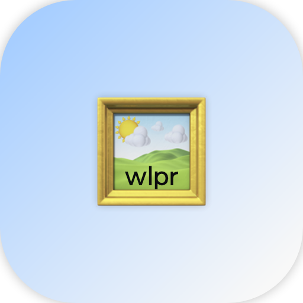

<!--
                    ***

                ~/README.md
    https://github.com/michalspano/wlpr
                @michalspano

                    ***
-->
<h1>
  <code>wlpr</code> - Wallpaper CLI Application for macOS  
</h1>

<!-- GitHub Shields -->
[![Forks][forks-shield]][forks-url]
[![Stargazers][stars-shield]][stars-url]
[![Contributors][contributors-shield]][contributors-url]
[![Issues][issues-shield]][issues-url]
[![MIT License][license-shield]][license-url]
[![Release][release-shield]][release-url]

### Table of Contents

  * [Introduction](#introduction)
  * [Demo](#demo)
  * [Insallation](#installation)
  * [Understanding the code](#understanding-the-code)
  * [Optional flag(s)](#optional-flags)
  * [Contributing](#contributing)

## Introduction

`wlpr` enables you to randomly cycle between desktop wallpapers on a macOS system from the command line. Written in pure `Go` with additional `applescript` (for system manipulation), it is a lightweight, simple, and easy to use `CLI` application.

__Context__: Suppose you have a folder of wallpapers on your local machine. You would like to choose a random wallpaper from this folder and set it as the current desktop wallpaper. Furthermore, you would like to check whether the newly selected wallpaper isn't the same as the current one, thus displaying a complete new wallpaper every time. All this shall be done in a single command. 

*Sounds familiar*? __wlpr__ is your friend.

## Demo


__FYI__, I'm using this [repositery](https://github.com/linuxdotexe/nordic-wallpapers) for __Nord-themed__ wallpapers in the demo. For the __Nord theme__ enthusiasts (like myself), create your own [here](https://ign.schrodinger-hat.it/). One last thing, my dotfiles (if anyone is interested) are [here](https://github.com/michalspano/personal-dotfiles).

## Installation

1. Fork the repository
```sh
$ git clone -b public --single-branch https://github.com/michalspano/wlpr.git && cd wlpr
```

2. Call the `init` script (from within the repository)
```sh
$ ./init <PATH-TO-IMAGE-FOLDER>
```
\*where `<PATH-TO-IMAGE-FOLDER>` is the path to the folder containing the images to choose from.

3. You are all set!
```sh
$ wlpr
```

If you aren't satisfied with `wlpr`, you can remove it (and all the source files) from the system by calling:
```sh
$ ./uninstall
```
__NOTE__: this script is found within the repository and must be called from within the repository only.

## Understanding the code

The `init` method creates a `~/.wlpr.json` file that contains the path to the folder containing the images to choose from and the root of the folder. This is a crucial piece of information that is used by `wlpr` to determine which images to choose from and where to retrieve the scipts from.

## Optional flag(s)

1. Omit the ending __message__ (default: display the message):
```sh
$ wlpr --no-message
$ wlpr -nm
```

\*Both of these variants are valid.

### Contributing

I'm __open__ to any contribution to the repository. If you have any suggestions or feedback, please open an __issue__ or __pull request__. :+1:

<!-- GitHub Shields -->
[contributors-shield]: https://img.shields.io/github/contributors/michalspano/wlpr.svg?style=for-the-badge
[contributors-url]: https://github.com/michalspano/wlpr/graphs/contributors
[forks-shield]: https://img.shields.io/github/forks/michalspano/wlpr.svg?style=for-the-badge
[forks-url]: https://github.com/michalspano/wlpr/network/members
[stars-shield]: https://img.shields.io/github/stars/michalspano/wlpr.svg?style=for-the-badge
[stars-url]: https://github.com/michalspano/wlpr/stargazers
[issues-shield]: https://img.shields.io/github/issues/michalspano/wlpr.svg?style=for-the-badge
[issues-url]: https://github.com/michalspano/wlpr/issues
[license-shield]: https://img.shields.io/github/license/michalspano/wlpr.svg?style=for-the-badge
[license-url]: https://github.com/michalspano/wlpr/blob/main/LICENSE
[release-shield]: https://img.shields.io/github/tag/michalspano/wlpr.svg?style=for-the-badge
[release-url]: https://github.com/michalspano/wlpr/releases/latest/